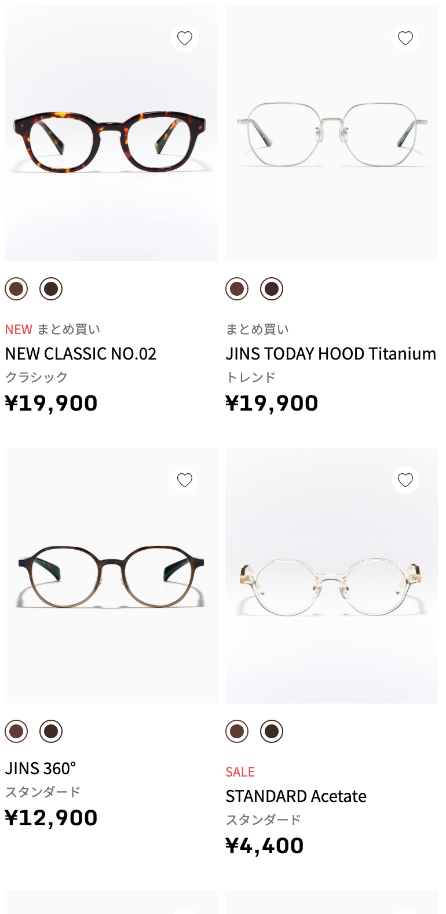
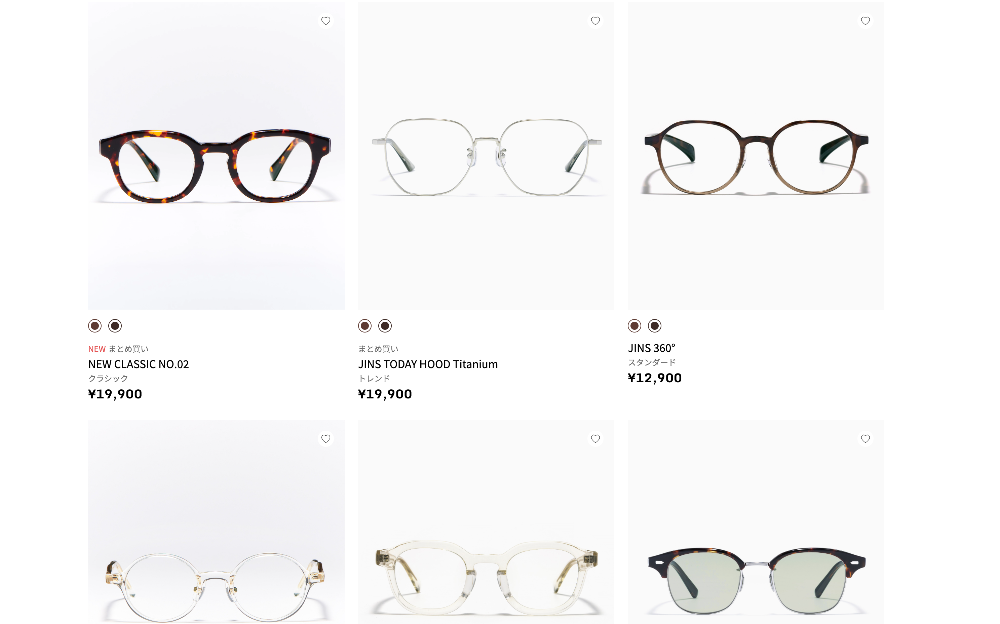

### Week 01: JINS Product Card Clone
A pixel-perfect recreation of a product card from the JINS eyewear website.

**🎨 Design (Figma):**
- Mastered **Auto Layout** for responsive spacing.
- Used `Hug` and `Fill` containers to control layout logic.
- Used `Component` to create cards

**💻 Engineering (Code):**
- **Semantic HTML:** Used `<article>`, `<main>`,`<ul>`, and `<button>` instead of generic `
`.
- **CSS Tricks:** Implemented `background-clip: content-box` for the double-ring color swatches.
- **Accessibility:** Added `aria-label` to icon-only buttons for screen readers.
- display of`flex` and `grid`
- variable of css `var(--btn-color)`
- Responsive design:Mobile First and then `@media` Media Queries(min-width:1024px) 
- how to align center in grid display? `margin-inline: auto;`(only affects the horizontal (inline) margins，have a defined width)

**📸 Preview:**
W01
> 
W02
> 
> 