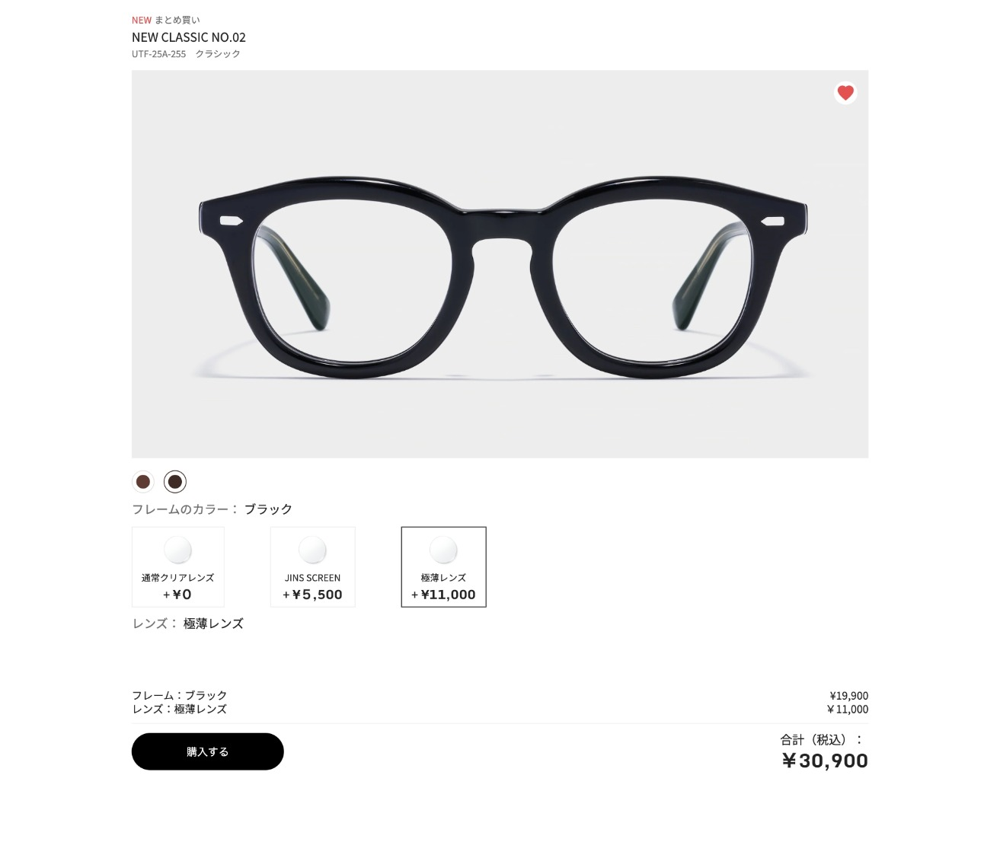

### Week 03-04: JS DOM Manipulation
feat: implement product detail page with dynamic pricing and color switcher

Description: This PR introduces the main interactivity for the JINS product page.

Key Changes:

✨ PDP Layout: Built the structure for the Product Detail Page.

🎨 Color Switcher: Users can now click buttons to toggle frame images.

💰 Lens Calculator: Logic to update the total price based on lens selection (¥0 vs ¥5,500).

📱 Responsive: Adapted layout from mobile to desktop.

**🎨 Design (Figma):**
- 

**💻 Engineering (Code):**
- `append` vs `appendChild`(elements only)
- `document.createElement("div")`
- `innerText`(visible on the screen) vs `textContent`（html itself）
- `getAttribute`,  `setAttribute`,`removeAttribute`  
- using const.attribute directtly `div.id`,`div.class`,`div.classList.add()`,`div.classList.remove()`,`classList.toggle("class",true)`
- `div.dataset.newTest`(`

`)

**📸 Preview:**
W01
> 
W02
> 
> 