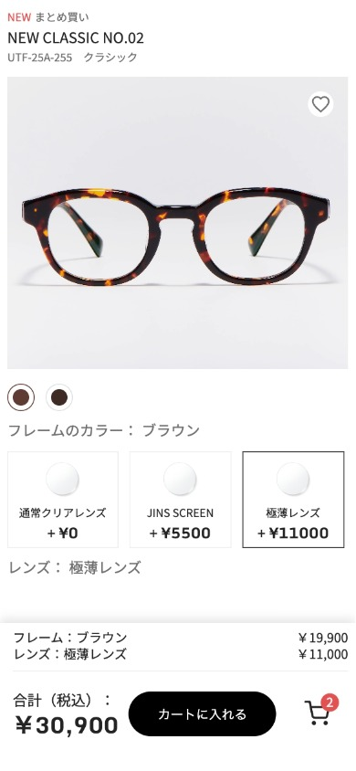
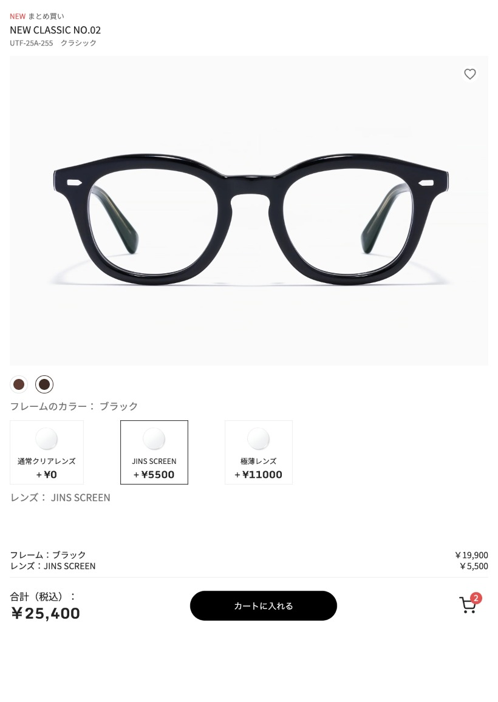
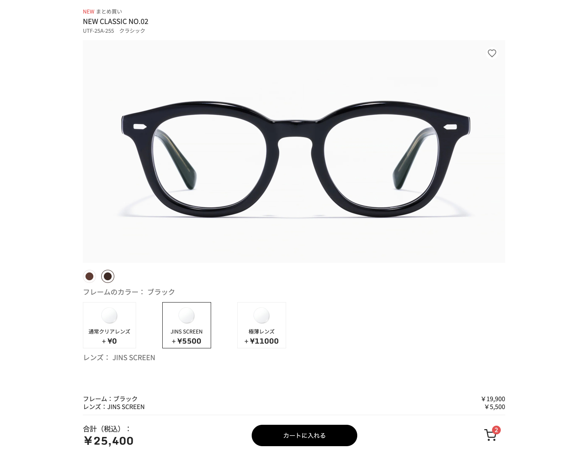

# Week 05-06: Advanced UI Patterns & State Management

> **Focus:** Data-Driven UI, LocalStorage Persistence, and Feedback Interactions (Toast).

## 🚀 Features Implemented
* **Data-Driven Architecture:** Refactored the entire codebase to render UI from a central "Database" (Array of Objects) instead of hardcoding HTML.
* **Global State Management:** Introduced a `currentOrder` object as the "Single Source of Truth". The UI now strictly reflects this state.
* **Persistent Cart & Drafts:** Used `LocalStorage` to save user selection (Draft) and shopping cart data, ensuring data survives page refreshes.
* **Smart Restoration:** The page automatically re-selects the user's last choices (Frame & Lens) upon loading.
* **Custom Toast Notification:** Built a toast notification system from scratch with CSS Keyframes (`toast-lifecycle`) for smooth entry/exit animations.
* **Real-time Cart Badge:** The shopping cart icon updates its count dynamically based on the LocalStorage data.

## 💻 Technical Highlights

### 1. Data-Driven Rendering (The "React" Mindset)
Moved away from manual DOM manipulation (`classList.add/remove` spaghetti) to a declarative rendering function.
```javascript
// Before: Manually finding and toggling classes
// Now: Re-rendering based on data state
function renderAndBindFrames() {
  const container = document.getElementById("color-swatches-container");
  // ... generating HTML based on framesDatabase ...
  container.innerHTML = htmlString; 
}
```
### 2. Reactive State Logic
Every user interaction updates the currentOrder state first, then triggers a re-render/update cycle.
```JavaScript
// 1. Update State
currentOrder.frameId = targetData.id;
// 2. Persist Data
saveDraftToLocal();
// 3. Update UI
renderAndBindFrames();
updateSummaryUI();
```
### 3. CSS Animations
Created a polished Toast notification lifecycle using CSS Keyframes.

Phase 1: slideUpFadeIn (Entry)

Phase 2: Stay visible

Phase 3: Slide up and fade out (Exit)

## 📸 Preview:
W05-06
> 
W02
> 
> 
